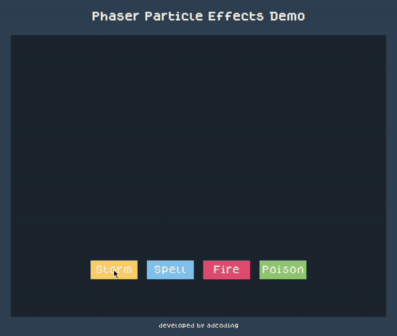

# Phaser Particles Demo

A simple demo project built with [Phaser 3](https://phaser.io/), showcasing different particle emitters such as **Spell**, **Fire**, **Poison**, and **Storm** effects.  
Interactive buttons allow you to trigger each effect.

---

## Demo Preview

  

---

## Features

- 🎇 **Spell Effect** – blue and white magical spark particles.  
- 🔥 **Fire Effect** – fiery explosion with gradient colors.  
- ☠️ **Poison Effect** – green toxic mist with floating motion.  
- ⚡ **Storm Effect** – lightning strikes with flash, shake, and branching sparks.  

---

## Getting Started

### Prerequisites
- Node.js installed  
- A static server (e.g., [http-server](https://www.npmjs.com/package/http-server)) or your preferred dev server.  

### Installation
Clone the repo:

```bash
git clone https://github.com/adcoding/phaser-particles
cd phaser-particles
